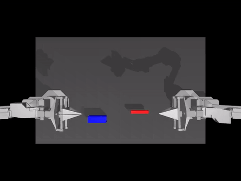
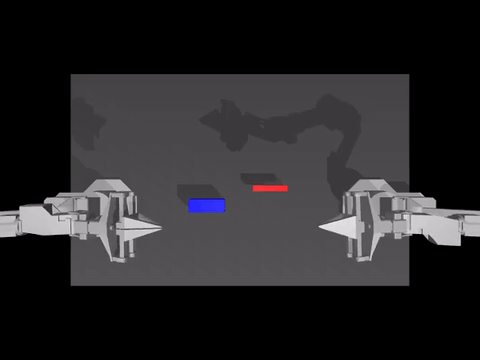
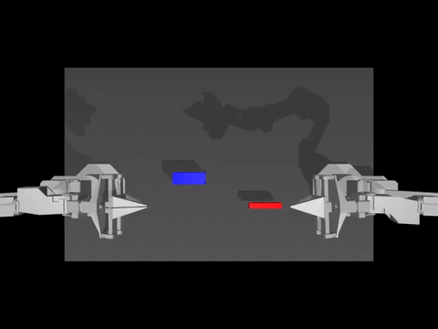

# ALOHA + LeRobot Ubuntu 실험 정리 가이드

**Ubuntu 기반 ALOHA simulation + LeRobot imitation learning 전체 실험 절차, 재현 방법, 개념 정리**

본 문서는 Ubuntu 환경에서 **MuJoCo 기반 ALOHA simulation**과 **LeRobot 기반 imitation learning(ACT policy)** 실험을 재현할 수 있도록 정리한 가이드입니다.  
목표는 다음과 같습니다.

1. **재부팅 또는 다음 세션에서도 동일한 실험을 재현**할 수 있도록 합니다.
2. 단순 명령어 나열이 아니라 **각 단계의 이론적 의미와 역할**을 이해할 수 있도록 합니다.
3. 개인 실험 로그를 넘어 **다른 사용자가 따라 할 수 있는 형식의 정식 실험 가이드**를 제공합니다.

본 문서는 두 층으로 구성됩니다.

- **일반화된 설명**: 동일한 환경에서 따라 할 수 있도록 공통 절차를 서술합니다.
- **실제 실험 환경 및 명령어**: 사용된 PC, 경로, 가상환경, 실행 명령을 예시로 제시합니다.

---

# 참고: 읽기 가이드 및 용어 정리

본 문서는 **독자 수준이 다양할 수 있음**을 전제로, 아래 읽기 가이드와 용어 정리를 제공합니다.

## 독자별 추천 흐름

| 대상                                               | 추천 흐름                                                                                                       | 비고                                                                      |
| -------------------------------------------------- | --------------------------------------------------------------------------------------------------------------- | ------------------------------------------------------------------------- |
| **해당 분야가 처음인 경우**                        | 용어 정리 → 1장 전체 그림 → 2장 ALOHA/LeRobot 역할 → 3장 시뮬레이션·모방 학습 선택 이유 → 이후 필요한 절만 참고 | policy, env, checkpoint 등 용어를 먼저 읽으면 흐름을 따라가기 수월합니다. |
| **로봇/강화학습은 익숙하나 본 스택은 처음인 경우** | 1장 → 2장 → 5장 흐름 → 6~8장(환경 점검) → 12~14장(데이터·ACT·학습)                                              | ALOHA·LeRobot·ACT 조합 위주로 참고하면 됩니다.                            |
| **실험 재현이 목적인 경우**                        | 4장 환경 → 5장 흐름 → 7~11장(재실행·확인) → 14~20장(학습·체크포인트·평가)                                       | 경로와 명령어를 자신의 환경에 맞게 변경하여 적용하면 됩니다.              |

## 핵심 용어 정리

본 문서에서 자주 사용하는 용어를 정리하였습니다. **해당 분야가 처음인 경우 이 절을 먼저 참고**하면 문서 내용을 따라가기 수월합니다.

- **시뮬레이션(Simulation)**  
  실제 로봇을 움직이지 않고, 컴퓨터 안에서 로봇과 환경을 수학적으로 모델링해 동작을 재현하는 것입니다. 게임 엔진처럼 “가상 세계”에서 로봇이 움직이고, 물리 법칙(중력, 충돌 등)이 적용됩니다.

- **환경(Environment, Env)**  
  로봇이 “살아있는” 세계라고 보면 됩니다. 환경이 **현재 상태(이미지, 관절 각도 등)** 를 주고, 로봇(또는 정책)이 **행동(action)** 을 내면, 환경이 **다음 상태**와 **보상(reward)** 등을 돌려줍니다. Gym/Gymnasium의 `env`가 바로 이 역할을 합니다.

- **정책(Policy)**  
  “지금 보이는 상황에서 어떤 행동을 할지”를 결정하는 함수 또는 신경망입니다. 카메라 이미지와 로봇 상태를 입력받아, 그리퍼를 얼마나 벌릴지, 팔을 어느 각도로 움직일지 같은 **action**을 출력합니다. **학습한다**는 것은 이 정책의 파라미터를 데이터나 보상을 이용해 조정하는 것입니다.

- **Imitation Learning(모방 학습)**  
  사람(또는 전문가)이 미리 수행한 **데모(demonstration)** 를 보고, “그 행동을 그대로 흉내 내도록” 정책을 학습하는 방식입니다. 보상을 직접 탐색하는 Reinforcement Learning(강화 학습)과 구별됩니다.

- **Demonstration / Dataset**  
  사람이 조작한 로봇의 “영상 + 상태 + 행동” 기록입니다. 각 시점마다 “이때 카메라에는 이렇게 보였고, 로봇은 이렇게 움직였다”가 저장되어 있고, 정책은 이걸 보고 같은 행동을 하도록 학습합니다.

- **Checkpoint**  
  학습 도중 또는 학습이 끝난 시점의 **정책(모델)과 학습 상태**를 파일로 저장해 둔 것입니다. 나중에 그 시점부터 학습을 이어가거나, 그 버전으로 평가(eval)할 때 사용합니다.

- **Evaluation(Eval)**  
  학습된 정책을 시뮬레이션 환경에 넣고, 실제로 몇 번 에피소드를 돌려서 **성공률, 보상** 등을 측정하는 것입니다. “얼마나 잘 하는가”를 숫자와 영상으로 확인하는 단계입니다.

- **GPU / CUDA**  
  딥러닝 학습은 연산량이 많아서 **GPU(그래픽 카드)** 를 사용합니다. CUDA는 NVIDIA GPU에서 연산을 수행하기 위한 플랫폼입니다. `nvidia-smi`로 GPU가 인식되는지, PyTorch가 CUDA를 쓰는지 확인합니다.

- **가상환경(Virtual Environment)**  
  프로젝트마다 필요한 Python 버전과 패키지가 다를 수 있어, **프로젝트별로 격리된 Python 환경**을 만드는 것입니다. `venv`, `conda` 등으로 만들며, “이 폴더에서는 Python 3.10 + MuJoCo, 저 폴더에서는 Python 3.12 + LeRobot”처럼 분리해 씁니다.

- **Reward(보상)**  
  환경이 “지금 행동이 얼마나 좋았는지”를 숫자로 알려주는 값입니다. insertion task에서는 peg가 hole에 가까워지거나, 삽입에 성공하면 보상이 주어질 수 있습니다. 정책은 보통 “보상이 크게 나오는 행동”을 학습하도록 설계됩니다.

- **Success / pc_success**  
  에피소드 끝에서 “과제를 성공했는지”를 0/1(또는 비율)로 나타낸 것입니다. 예를 들어 peg가 hole에 완전히 들어가면 성공으로 칩니다.

---

# 0. 참고 자료

본 가이드는 아래 공식 자료 및 실제 실험 과정을 바탕으로 정리하였습니다.

- Aloha Sim GitHub: https://github.com/google-deepmind/aloha_sim
- LeRobot 설치 문서: https://huggingface.co/docs/lerobot/en/installation
- MuJoCo Python 문서: https://mujoco.readthedocs.io/en/stable/python.html
- PyTorch CUDA memory 관리 문서: https://docs.pytorch.org/docs/stable/notes/cuda.html

공식 문서는 버전에 따라 변경될 수 있으므로, 버전 차이가 있을 경우 위 링크를 먼저 확인하는 것이 권장됩니다.

## 0.1 저장소 구조 및 Git 관리

본 프로젝트는 **studyALOHA** 단일 Git 저장소로 관리하며, 아래 두 디렉터리는 **외부 저장소를 클론한 서브모듈**입니다.

| 디렉터리     | 원본 저장소                                                               |
| ------------ | ------------------------------------------------------------------------- |
| `aloha_sim/` | [google-deepmind/aloha_sim](https://github.com/google-deepmind/aloha_sim) |
| `lerobot/`   | [huggingface/lerobot](https://github.com/huggingface/lerobot)             |

이 구조는 **Git 서브모듈**로 관리하는 것이 권장됩니다. 상위 저장소(studyALOHA)는 "현재 실험에서 사용하는 aloha_sim·lerobot의 커밋"만 기록하며, 실제 코드는 각 원본 저장소에서 유지됩니다.

### 이 저장소를 처음 클론할 때

```bash
# 서브모듈까지 한 번에 받기
git clone --recurse-submodules <이 저장소 URL> studyALOHA
cd studyALOHA
```

이미 일반 `git clone`만 수행한 경우:

```bash
git submodule update --init --recursive
```

### 서브모듈로 전환하는 방법 (aloha_sim, lerobot을 이미 일반 클론한 경우)

`aloha_sim`, `lerobot`을 일반 클론한 상태에서 서브모듈로 전환하려면 아래 순서를 따릅니다. **aloha_sim 또는 lerobot 내부를 수정한 경우, 먼저 백업하거나 해당 저장소에 커밋해 두는 것이 좋습니다.**

```bash
# 1) 상위 저장소 루트에서
cd /path/to/studyALOHA

# 2) 기존 디렉터리 제거 (내부 .git 때문에 내용만 지우고 서브모듈로 다시 받을 예정)
rm -rf aloha_sim lerobot

# 3) 서브모듈로 추가 (원격 URL + 사용할 브랜치/커밋이 기록됨)
git submodule add https://github.com/google-deepmind/aloha_sim.git aloha_sim
git submodule add https://github.com/huggingface/lerobot.git lerobot

# 4) 커밋
git add .gitmodules aloha_sim lerobot
git commit -m "Add aloha_sim and lerobot as submodules"
```

본 저장소는 **삭제 없이** 기존 `aloha_sim`, `lerobot` 디렉터리를 서브모듈로 등록해 두었습니다. 학습 중인 로컬 파일은 유지한 채, 아래 "버전 올리기" 절에 따라 원본만 `pull`하여 반영할 수 있습니다.

### 서브모듈이 가리키는 버전 올리기 (원본에서 업데이트 받기)

학습을 진행 중이어도 **원본(aloha_sim, lerobot)의 최신 변경만 반영**할 수 있습니다. 각 서브모듈 디렉터리에서 `pull`한 뒤, 상위 저장소에 "사용할 커밋"만 커밋하면 됩니다. **디렉터리를 삭제할 필요가 없으며, 로컬에서 생성한 파일(학습 결과 등)은 그대로 두고** 원본 코드만 갱신할 수 있습니다.

```bash
# aloha_sim 최신 반영
cd aloha_sim
git fetch origin
git pull origin main   # 기본 브랜치가 main이 아닐 수 있음 (예: master)
cd ..
git add aloha_sim
git commit -m "Update aloha_sim to latest"

# lerobot도 같은 방식
cd lerobot
git fetch origin
git pull origin main
cd ..
git add lerobot
git commit -m "Update lerobot to latest"
```

각 서브모듈 디렉터리에서 `git status`로 로컬 수정·추가 파일을 확인할 수 있습니다. 학습 체크포인트 등은 유지한 채 원본 코드만 갱신하려면, 위와 같이 `pull` 후 studyALOHA 루트에서 `git add`·`commit`을 수행하면 됩니다.

---

# 1. 본 문서가 다루는 전체 그림

실험 절차를 크게 요약하면 다음과 같습니다.

1. **Ubuntu에서 NVIDIA GPU 드라이버 정상화**
2. **PyTorch CUDA 사용 가능 여부 확인**
3. **MuJoCo 설치 및 최소 physics step 테스트**
4. **Aloha Sim viewer 실행 확인**
5. **LeRobot 설치 및 ALOHA environment 연동 확인**
6. **ALOHA insertion demonstration dataset으로 ACT policy 학습**
7. **checkpoint 저장 및 resume 학습**
8. **3k / 30k / 60k step policy evaluation**
9. **reward / success rate / video를 통한 policy 수준 해석**

본 문서는 단순 설치 가이드가 아니라, 위 전체 파이프라인을 다룹니다.

```text
GPU/OS 준비
→ Python 환경 준비
→ MuJoCo / Aloha Sim 동작 확인
→ LeRobot 학습 환경 준비
→ Dataset 기반 imitation learning
→ Checkpoint 저장
→ Evaluation
→ 결과 해석
```

### 보충: 이 파이프라인을 한 문장으로

- **참고**: “시뮬레이션 로봇(ALOHA)이 peg를 hole에 끼우는 과제를, 사람이 미리 해 둔 데모 영상을 보고 배우고(imitation learning), 그걸 다시 시뮬레이션에서 테스트해 보는” 흐름입니다. 실제 로봇은 없고, 전부 컴퓨터 안에서 돌아갑니다.
- **각 단계가 왜 필요한지**: GPU가 있어야 학습 속도가 나옵니다. MuJoCo·Aloha Sim이 있어야 “로봇이 있는 가상 세계”가 돌아가고, LeRobot이 있어야 “데모를 보고 배우는 학습”을 할 수 있습니다. Dataset은 “선생님(데모)” 역할을 하고, checkpoint는 “중간 저장”이라 나중에 이어서 학습하거나 성능을 재현할 때 씁니다.

---

# 2. ALOHA와 LeRobot의 역할 구분

본 절은 전체 이해의 핵심입니다.

## 2.1 ALOHA란

ALOHA는 본 가이드에서 **로봇 조작 문제를 정의하는 환경(domain)** 을 의미합니다.

ALOHA가 제공하는 항목은 다음과 같습니다.

- 로봇 구조: 양팔 로봇, 관절, 그리퍼
- 관측: 카메라 이미지, 상태값
- 행동 공간: joint action 또는 제어 입력
- 태스크: insertion, cube transfer 등
- 보상 및 성공 판정 규칙
- MuJoCo 기반 물리 시뮬레이션

즉 ALOHA는 **“어떤 문제를 풀 것인가”** 를 정의합니다.

예를 들어 `AlohaInsertion-v0`는 다음을 의미합니다.

- 로봇이 peg와 hole을 사용한 insertion task를 수행하며
- 이미지와 상태를 관측으로 받고
- action을 출력하며
- 환경이 reward와 success를 판정합니다.

## 2.2 LeRobot이란

LeRobot은 **정책(policy)을 학습·저장·평가하는 프레임워크**입니다.

LeRobot이 담당하는 역할은 다음과 같습니다.

- dataset 로딩
- policy architecture 구성 (예: ACT)
- optimizer / scheduler 설정
- train loop 실행
- checkpoint 저장
- eval loop 실행

즉 LeRobot은 **“그 문제를 어떤 모델로 학습시킬 것인가”** 를 담당합니다.

## 2.3 둘의 관계

요약하면 다음과 같습니다.

- **ALOHA = 문제 정의**
- **LeRobot = 학습 엔진**

비유하면 다음과 같습니다.

- ALOHA = 시험장, 시험 문제, 채점 기준
- LeRobot = 수험생을 훈련시키는 학습 시스템

본 가이드에서 진행한 실험은 다음과 같이 정의할 수 있습니다.

- **ALOHA insertion task** 를 대상으로
- **ALOHA sim demonstration dataset** 을 사용하여
- **LeRobot의 ACT policy** 를 학습하고
- **ALOHA env에서 평가**한 실험입니다.

### 보충: ALOHA와 LeRobot을 비유로 이해하기

- **참고**: ALOHA는 “시험 문제와 시험장”입니다. “peg를 hole에 끼워 넣어라”라는 문제, 그걸 수행할 로봇, 카메라와 센서, 성공/실패를 알려주는 채점 기준이 모두 ALOHA 안에 있습니다. LeRobot은 “그 시험을 대비해 공부하는 시스템”입니다. 데모 영상(데이터셋)을 보고, 신경망(ACT policy)을 훈련시키고, 중간중간 저장(checkpoint)하고, 나중에 시험장(ALOHA env)에서 다시 테스트(eval)합니다.
- **왜 둘을 나누는가**: 문제를 정의하는 쪽(ALOHA)과, 그 문제를 푸는 모델을 학습하는 쪽(LeRobot)을 분리해 두면, 다른 태스크(예: cube 옮기기)나 다른 학습 방법을 바꿔 끼우기 쉽습니다. 한 프로젝트에서 “같은 로봇 환경, 다른 정책” 실험을 할 때도 이해하기 좋습니다.
- **요약**: 본 문서는 ALOHA가 정의한 insertion이라는 한 가지 문제를 LeRobot으로 ACT 정책을 학습시키는 구성을 다룹니다. env 이름(`AlohaInsertion-v0`), dataset, 학습 명령어는 모두 이 구조에 연결됩니다.

---

# 3. 왜 simulation + imitation learning을 사용하는가

실제 로봇을 직접 학습시키는 것은 비용과 위험이 큽니다.

## 3.1 실제 로봇 학습의 어려움

- 하드웨어 비용이 큽니다.
- 시행착오 속도가 느립니다.
- 잘못된 policy가 기구를 손상시킬 수 있습니다.
- dataset 수집 비용이 큽니다.
- reset 및 반복 실험이 번거롭습니다.

## 3.2 시뮬레이션의 장점

- 반복 실험이 빠릅니다.
- 실패 비용이 낮습니다.
- evaluation을 여러 번 자동 수행하기 쉽습니다.
- debugging과 visualization이 용이합니다.

## 3.3 imitation learning의 장점

본 실험은 reinforcement learning이 아니라 **imitation learning**입니다.

즉 policy가 보상을 직접 탐색하는 것이 아니라,  
이미 수집된 **demonstration trajectory**를 참고하여 그 행동을 모방하도록 학습합니다.

이 방식은 다음에 유리합니다.

- 초기 학습 안정성
- sparse reward 문제 회피
- 조작 태스크에서의 빠른 성능 확보

ALOHA insertion과 같이 정밀 조작이 필요한 task에서는 imitation learning이 일반적인 시작점입니다.

### 보충: 시뮬레이션 + 모방 학습을 선택한 이유

- **참고**: 실제 로봇을 사서 돌리면 비싸고, 한 번 실패할 때마다 리셋하고 다시 놓는 것도 번거롭습니다. 그래서 먼저 **컴퓨터 안의 가상 로봇(시뮬레이션)** 으로 실험합니다. 그리고 “보상을 찾아서 시행착오”하는 강화 학습보다, **사람이 해 둔 데모를 그대로 흉내 내게 하는(imitation learning)** 방식이 조작 태스크에서는 보통 더 빠르고 안정적으로 잘 됩니다.
- **RL vs IL 차이**: RL은 시도와 보상을 통해 좋은 행동을 찾아가는 방식이고, IL은 이미 주어진 데모 행동을 배우는 방식입니다. insertion처럼 정밀한 동작은 데모 기반 모방 학습이 시작점으로 적합합니다.
- **요약**: “이 실험은 실제 로봇 없이, 시뮬만으로, 그리고 강화 학습이 아니라 모방 학습으로 진행한다”라고 명시해 두면, 왜 dataset이 중요한지, 왜 success가 0이어도 reward가 오르는 구간을 보는지 설명하기 쉬워집니다.

---

# 4. 실험에 사용한 환경 (예시)

아래는 본 실험에 사용한 환경입니다.  
다른 사용자는 **자신의 환경에 맞게 경로 및 사양을 변경**하여 적용하면 됩니다.

## 4.1 하드웨어

- GPU: **NVIDIA RTX 3070 Laptop GPU (8GB)**
- CPU: Ryzen 9 5900HX
- RAM: 32GB

## 4.2 운영체제

- Ubuntu

## 4.3 작업 경로

```bash
~/study/workspace/physicalAI/studyALOHA
```

## 4.4 Python 환경 구성

본 실험에서는 두 개의 가상환경을 사용하였습니다.

### A. `aloha-venv`

용도:

- MuJoCo
- Aloha Sim viewer
- 시뮬레이터 검증

### B. `lerobot-py312`

용도:

- LeRobot 학습
- ALOHA env + dataset + ACT training + eval

환경을 분리한 이유는 다음과 같습니다.

- Aloha Sim은 Python 3.10 venv에서 안정적으로 동작을 확인하였고
- LeRobot main branch는 Python 3.12를 요구하며
- 두 환경을 분리하는 것이 의존성 충돌 회피에 유리하기 때문입니다.

### 보충: 환경 구성이 처음이신 경우

- **가상환경이 뭔지**: Python으로 여러 프로젝트를 할 때, “이 프로젝트는 Python 3.10 + MuJoCo, 저 프로젝트는 Python 3.12 + PyTorch”처럼 **버전과 패키지를 프로젝트마다 따로 쓰기 위해** 만든 격리 공간입니다. `aloha-venv`와 `lerobot-py312`를 쓰는 이유는, Aloha Sim과 LeRobot이 요구하는 Python 버전이 달라서입니다. 한 환경에 다 넣으면 패키지 충돌이 날 수 있어 분리했습니다.
- **경로를 바꿔도 되는 부분**: 문서에 나오는 `~/study/workspace/physicalAI/studyALOHA`나 `/home/kimdawoon/...` 같은 경로는 **예시**입니다. 독자가 자신의 환경에서 따라 할 때는 자신이 프로젝트를 둔 폴더 경로로 바꾸면 됩니다. `OUTDIR`, `MODEL` 등에 들어가는 경로도 동일하게 자신의 환경에 맞게 수정하면 됩니다.
- **GPU가 없거나 8GB 이하인 경우**: 학습 시 `batch_size=1`로 줄이고, eval 시 `batch_size`를 1로 두는 등 메모리를 아끼는 설정을 쓰면 됩니다. OOM(메모리 부족)이 나면 18장 내용을 참고해 주세요.

---

# 5. 실험의 전체 흐름

실험은 크게 4단계로 구분됩니다.

## 단계 1. 시스템/GPU 세팅

- Secure Boot 비활성화
- NVIDIA 드라이버 정상화
- `nvidia-smi` 확인

## 단계 2. 시뮬레이터 세팅

- Python venv 생성
- MuJoCo 설치
- Aloha Sim clone 및 viewer 확인

## 단계 3. 학습 프레임워크 세팅

- Conda 설치
- Python 3.12 env 생성
- LeRobot 설치
- ALOHA env 등록 확인

## 단계 4. 정책 학습 및 평가

- ACT policy 학습
- checkpoint 저장
- 3k / 30k / 60k eval
- reward / success 추세 해석

### 보충: 네 단계의 역할

- **단계 1 (시스템/GPU)**: “학습은 GPU로 돌리기 때문에, 우선 GPU가 Ubuntu에서 제대로 잡히는지 확인하는 단계”라고 하면 됩니다. Secure Boot 때문에 드라이버가 안 잡히는 경우가 많아서, 그때 BIOS에서 Secure Boot를 끄는 절차를 6장에서 다룹니다.
- **단계 2 (시뮬레이터)**: “로봇이 도는 가상 세계(MuJoCo)와 ALOHA 뷰어가 정상 동작하는지 확인하는 단계”입니다. 여기서 막히면 8·9장의 명령을 그대로 따라 해 보면서, Python 가상환경 활성화와 `MUJOCO_GL=egl` 설정을 점검하면 됩니다.
- **단계 3 (학습 프레임워크)**: “LeRobot을 깔고, 그 안에서 ALOHA 환경이 등록돼 있는지 확인하는 단계”입니다. 11장에서 `gym_aloha`가 보이는지 확인하는 코드가 나옵니다. 여기까지 되면 “데모를 보고 배울 준비”가 된 것입니다.
- **단계 4 (학습·평가)**: 학습을 실행하고 checkpoint를 주기적으로 저장하며, 3k/30k/60k step 시점에서 eval로 성능을 측정하는 단계입니다. step 수에 따른 reward 변화를 그래프나 숫자로 확인하면 학습 구간별 수준을 파악할 수 있습니다.

---

# 6. GPU 드라이버 문제 해결 과정

초기에는 `nvidia-smi`가 실패하였습니다.

예시 오류:

```bash
nvidia-smi
NVIDIA-SMI has failed because it couldn't communicate with the NVIDIA driver.
```

## 6.1 원인

실제 상태는 다음과 같았습니다.

- GPU 자체는 시스템에서 보임
- Ubuntu 추천 드라이버도 존재
- 하지만 `lsmod | grep nvidia` 결과가 비어 있음
- `Secure Boot enabled`

이 조합은 Ubuntu에서 자주 보이는 패턴으로,  
**Secure Boot 때문에 NVIDIA kernel module이 로드되지 않는 경우**가 많습니다.

## 6.2 해결 절차

1. BIOS/UEFI 진입
2. Secure Boot 비활성화
3. Ubuntu 부팅
4. NVIDIA 드라이버 설치/재설치
5. 재부팅 후 확인

## 6.3 확인 명령어

```bash
mokutil --sb-state
lsmod | grep nvidia
nvidia-smi
```

정상 예시:

```bash
SecureBoot disabled
```

`nvidia-smi` 실행 시 아래 정보가 표시되어야 합니다.

- Driver Version
- CUDA Version
- GPU 이름 (RTX 3070 Laptop GPU)

### 보충: GPU 문제가 났을 때

- **왜 Secure Boot가 걸리는가**: Ubuntu에서 NVIDIA 드라이버는 **커널 모듈**로 동작합니다. Secure Boot가 켜져 있으면 서명되지 않은 커널 모듈을 막기 때문에, NVIDIA 모듈이 로드되지 않아 `nvidia-smi`가 실패할 수 있습니다. 그래서 개발·학습용 PC에서는 Secure Boot를 끄고 드라이버를 쓰는 경우가 많습니다.
- **동일 증상이 있는 경우**: `nvidia-smi`가 실패하고 `lsmod | grep nvidia` 결과가 비어 있다면 위 조합을 의심할 수 있습니다. BIOS 진입 방법(제조사마다 F2, Del, F12 등 상이)을 확인한 뒤, Secure Boot 비활성화는 각 환경에서 수행하면 됩니다.
- **참고**: `mokutil --sb-state`는 “지금 Secure Boot가 켜져 있는지” 확인하는 명령입니다. `SecureBoot enabled`면 BIOS에서 끄고, 재부팅 후 다시 확인합니다.

---

# 7. Ubuntu 재부팅 후 가장 먼저 할 확인

재부팅 또는 다음 세션에서 작업을 재개할 때는 먼저 아래 항목을 확인하는 것이 좋습니다.

## 7.1 GPU 상태 확인

```bash
nvidia-smi
```

## 7.2 GPU 모듈 확인

```bash
lsmod | grep nvidia
```

## 7.3 CUDA 가능한 PyTorch 확인

(LeRobot 환경에서)

```bash
conda activate lerobot-py312
python -c "import torch; print(torch.__version__); print(torch.cuda.is_available()); print(torch.cuda.get_device_name(0) if torch.cuda.is_available() else 'No GPU')"
```

### 보충: 재부팅 후 확인이 필요한 이유

- **왜 매번 확인하는가**: 재부팅 후에는 GPU 드라이버나 모듈이 다시 로드됩니다. 간혹 드라이버가 안 잡히거나, PyTorch가 CPU만 쓰는 상태로 올 수 있어, **학습/평가 전에 한 번씩** GPU와 CUDA가 보이는지 확인하는 것이 안전합니다.
- **참고**: `nvidia-smi`는 GPU 개수와 메모리 사용량을 확인하는 명령입니다. `torch.cuda.is_available()`이 `True`여야 PyTorch가 GPU로 학습합니다. `False`면 드라이버나 CUDA 버전을 점검해야 합니다.
- **체크리스트로 쓰기**: 24장 “작업 재개 시 빠른 체크리스트”와 연결해서, “매일 또는 재부팅 후에는 7장 → 8장(Aloha Sim) → 10장(LeRobot) 순서로 확인하면 된다”고 정리해 줄 수 있습니다.

---

# 8. Aloha Sim 재실행 방법

시뮬레이터가 정상 동작하는지 확인하려면 아래 순서대로 실행합니다.

## 8.1 가상환경 활성화

```bash
cd ~/study/workspace/physicalAI/studyALOHA
source aloha-venv/bin/activate
```

## 8.2 OpenGL backend 설정

```bash
export MUJOCO_GL=egl
```

설명:

- `egl`은 headless 또는 GPU 가속 렌더링에 유리합니다.
- 환경에 따라 `glfw` 또는 자동 선택이 적합할 수 있으며, Ubuntu에서는 `egl`을 먼저 시도하는 것이 일반적으로 안전합니다.

## 8.3 Aloha Sim 저장소로 이동

```bash
cd ~/study/workspace/physicalAI/studyALOHA/aloha_sim
```

## 8.4 Viewer 실행

```bash
python aloha_sim/viewer.py --policy=no_policy --task_name=HandOverBanana
```


설명:

- `no_policy`는 학습된 정책 없이 viewer와 task만 확인하는 모드입니다.
- 이 단계는 시뮬레이터 기동 여부를 확인하는 최소 검증입니다.

### 보충: Aloha Sim이 안 켜질 때

- **참고**: “시뮬레이터”는 실제 로봇 대신 컴퓨터 안에서 로봇과 환경을 돌리는 프로그램입니다. Aloha Sim은 그중 하나이고, MuJoCo라는 물리 엔진 위에서 동작합니다. `viewer.py`를 실행하면 로봇이 보이는 창이 뜨고, `no_policy` 모드에서는 학습된 정책 없이 환경만 확인합니다.
- **`MUJOCO_GL=egl`이 뭔가**: 렌더링(화면 그리기) 방식을 정하는 환경 변수입니다. 서버(모니터 없음)나 SSH 환경에서는 `egl`이 잘 동작하는 경우가 많고, Ubuntu 데스크톱에서도 많은 경우 문제없이 씁니다. 오류가 나면 `glfw`로 바꿔 보거나 공식 문서를 참고하면 됩니다.
- **실패 시 점검**: (1) 가상환경이 맞는지(`source aloha-venv/bin/activate`), (2) `cd`가 `aloha_sim`인지, (3) `MUJOCO_GL=egl`을 설정했는지, (4) GPU 드라이버가 잡혀 있는지 순서대로 확인하라고 안내할 수 있습니다.

---

# 9. MuJoCo 최소 테스트

MuJoCo가 정상 설치되었는지 빠르게 검증하는 최소 예시는 아래와 같습니다.

```bash
python - <<'PY'
import mujoco

xml = """
<mujoco>
  <worldbody>
    <light pos="0 0 3"/>
    <geom type="plane" size="1 1 0.1"/>
    <body pos="0 0 1">
      <joint type="free"/>
      <geom type="box" size="0.1 0.1 0.1"/>
    </body>
  </worldbody>
</mujoco>
"""

model = mujoco.MjModel.from_xml_string(xml)
data = mujoco.MjData(model)

for _ in range(100):
    mujoco.mj_step(model, data)

print("MuJoCo step OK")
print("qpos:", data.qpos)
PY
```

정상이라면 `MuJoCo step OK`가 출력됩니다.

이 테스트는 다음을 한 번에 확인합니다.

- Python binding이 import되는지
- XML 모델 생성이 되는지
- physics step이 정상적으로 수행되는지

### 보충: MuJoCo 테스트의 의미

- **참고**: MuJoCo는 “물리 법칙이 적용된 시뮬레이션 엔진”입니다. 이 짧은 코드는 “간단한 상자 하나가 떨어지는 세계”를 만들고, 100 step 동안 물리 시뮬레이션을 돌려 봅니다. `MuJoCo step OK`가 나오면 Python에서 MuJoCo를 쓰는 데 문제가 없다는 뜻입니다. Aloha Sim도 이 MuJoCo 위에서 돌아가므로, MuJoCo가 동작해야 ALOHA 시뮬도 동작합니다.
- **요약**: “Aloha Sim 뷰어가 안 뜰 때, MuJoCo만 따로 테스트해 보면 ‘MuJoCo 문제인지, Aloha Sim 코드 문제인지’ 구분할 수 있다”고 말해 줄 수 있습니다.

---

# 10. LeRobot 환경 재실행 방법

LeRobot 학습·평가를 다시 시작할 때는 아래 명령을 사용합니다.

## 10.1 Conda env 활성화

```bash
conda activate lerobot-py312
```

## 10.2 저장소 이동

```bash
cd ~/study/workspace/physicalAI/studyALOHA/lerobot
```

## 10.3 GPU 상태 확인

```bash
python -c "import torch; print(torch.__version__); print(torch.cuda.is_available()); print(torch.cuda.get_device_name(0) if torch.cuda.is_available() else 'No GPU')"
```

### 보충: LeRobot 환경만 따로 쓸 때

- **왜 conda를 쓰는가**: LeRobot은 Python 3.12 등을 요구하고, 여러 의존성이 있어서 conda로 환경을 만든 경우가 많습니다. `conda activate lerobot-py312`로 이 환경에 들어가야 `lerobot-train`, `lerobot-eval` 같은 명령을 쓸 수 있습니다.
- **경로**: 학습·평가 시 작업 디렉터리는 보통 `lerobot` 저장소 루트(`studyALOHA/lerobot`)로 두고 명령을 실행합니다. 출력 디렉터리(`outputs/`)는 프로젝트 루트 등 원하는 곳으로 지정하면 됩니다.
- **재개 시**: “오늘은 학습만 할 거다”면 10장만 따라 하면 됩니다. 시뮬까지 확인하려면 7·8장을 먼저 하고 10장으로 넘어가면 됩니다.

---

# 11. ALOHA environment 등록 확인

LeRobot에서 ALOHA env가 정상 등록되었는지 확인할 때 사용한 코드는 아래와 같습니다.

```bash
python - <<'PY'
import gymnasium as gym
import gym_aloha

ids = sorted([k for k in gym.envs.registry.keys() if "aloha" in k.lower()])
print("ALOHA env ids:")
for env_id in ids:
    print(env_id)
PY
```

확인된 env id 예시:

```bash
gym_aloha/AlohaInsertion-v0
gym_aloha/AlohaTransferCube-v0
```

ALOHA insertion task 사용 시에는 위와 동일한 이름 체계를 사용해야 합니다.

### 보충: “env 등록”이 뭔지

- **참고**: LeRobot이 학습·평가할 때 “ALOHA insertion 환경을 불러와라”라고 하려면, 그 환경이 **이름으로 등록**돼 있어야 합니다. `gymnasium`(구 Gym)은 `gym.register(...)`로 환경을 등록하고, `gym_aloha` 패키지가 설치되면 `gym_aloha/AlohaInsertion-v0` 같은 id로 쓸 수 있게 됩니다. 위 코드는 “현재 등록된 환경 중 이름에 aloha가 들어간 것”을 출력해서, 우리가 쓸 env id가 있는지 확인하는 것입니다.
- **다른 태스크를 쓰고 싶다면**: `AlohaTransferCube-v0`처럼 다른 env id를 쓰면 됩니다. 그에 맞는 dataset과 task 이름을 학습/평가 명령에서 바꾸면 됩니다.

---

# 12. 사용한 데이터셋

학습에 사용한 dataset은 다음과 같습니다.

```bash
lerobot/aloha_sim_insertion_human
```

이 dataset은 ALOHA insertion task용 demonstration dataset이며,  
다음 정보를 포함합니다.

- top camera image
- robot state
- action trajectory

즉 policy는 이 demonstration을 참고하여 다음을 학습합니다.

- 이미지를 해석하여 물체·로봇 상태를 파악하고
- 주어진 상태에서 사람이 수행한 action을 모방하도록

이것이 imitation learning의 핵심입니다.

### 보충: 데이터셋이 왜 중요한지

- **참고**: “데모”는 사람이 시뮬레이션(또는 실제 로봇)을 조작하면서 “어떤 순간에 카메라에는 뭐가 보였고, 로봇은 그때 이렇게 움직였다”를 기록한 것입니다. 이걸 많이 모은 것이 **dataset**이고, 정책은 이 (이미지, 상태) → (행동) 쌍을 보고 “비슷한 상황이면 비슷한 행동을 하자”라고 학습합니다. 그래서 **데이터 품질과 양**이 모방 학습 성능에 크게 영향을 줍니다.
- **이 실험에서 쓰는 데이터**: `lerobot/aloha_sim_insertion_human`은 ALOHA insertion 태스크를 사람이 시뮬에서 수행한 데모를 모아 둔 공개 데이터셋입니다. “어떤 데이터로 학습했는지”를 명시해 두면 재현과 비교가 쉽습니다.
- **요약**: “지금 우리는 이 공개 데이터셋을 그대로 쓰고, 정책 구조(ACT)와 학습 step 수만 바꿔 가며 실험한다”고 하면, 데이터 수집 없이도 실험을 시작할 수 있다는 점을 강조할 수 있습니다.

---

# 13. 사용한 policy: ACT

## 13.1 ACT란

ACT는 **Action Chunking Transformer**입니다.

핵심 아이디어는 다음과 같습니다.

- action을 한 step씩 예측하는 대신
- **여러 step의 action chunk를 한 번에 예측**
- image + proprioception(state)를 함께 입력으로 사용
- 시간적으로 연결된 조작 행동을 더 안정적으로 모델링

## 13.2 ALOHA에 적합한 이유

ALOHA insertion과 같은 task에서는:

- 한 순간의 action보다
- 일정 구간 동안의 연속적인 행동 구조가 중요합니다.

예를 들어:

- peg 접근
- 자세 정렬
- 삽입 시도
- 미세 보정

은 모두 시간 연속성이 강합니다.  
ACT는 이러한 robot manipulation imitation learning에 적합합니다.

## 13.3 본 실험의 주요 ACT 설정 예시

로그에서 확인한 대표 설정:

- `vision_backbone = resnet18`
- `chunk_size = 100`
- `n_action_steps = 100`
- `n_obs_steps = 1`
- `dim_model = 512`

즉 현재 policy는 대략:

- 현재 관측(image + state)을 보고
- 앞으로 100 step 정도의 action sequence를 예측하는 구조

로 이해할 수 있습니다.

### 보충: ACT를 쉽게 설명하기

- **참고**: “한 번에 한 스텝만 예측”하면 오차가 쌓여서 로봇이 흔들리기 쉽습니다. ACT는 **앞으로 여러 스텝의 동작을 한 덩어리(chunk)로 예측**합니다. 그래서 “지금부터 100 step은 이렇게 움직인다”처럼 더 연속적인 동작을 만들 수 있어, peg를 hole에 끼우는 같은 **연속 조작**에 잘 맞습니다.
- **vision_backbone, chunk_size 등**: 시각 입력을 처리하는 CNN(예: ResNet18), 한 번에 예측하는 action 개수(chunk_size=100) 등은 모델 크기와 동작 길이를 정하는 설정입니다. 현재는 100 step 단위로 행동을 예측하는 구조로 이해할 수 있습니다.
- **다른 policy를 쓰고 싶다면**: LeRobot은 ACT 외에도 다른 정책을 지원할 수 있습니다. 문서와 설정 옵션을 보고 `--policy.type` 등을 바꾸면 됩니다.

---

# 14. 학습 명령어 정리

아래는 실제로 사용한 명령어입니다.  
경로는 본 실험 환경 기준이며, 다른 사용자는 자신의 환경에 맞게 변경하면 됩니다.

## 14.1 3k 학습

```bash
conda activate lerobot-py312
cd ~/study/workspace/physicalAI/studyALOHA/lerobot

OUTDIR=/home/kimdawoon/study/workspace/physicalAI/studyALOHA/outputs/act_aloha_insertion_3k

TOKENIZERS_PARALLELISM=false MUJOCO_GL=egl \
lerobot-train \
  --output_dir="$OUTDIR" \
  --job_name=act_aloha_insertion_3k \
  --policy.type=act \
  --policy.device=cuda \
  --policy.repo_id=kimdawoon/act-aloha-insertion-3k \
  --policy.push_to_hub=false \
  --env.type=aloha \
  --env.task=AlohaInsertion-v0 \
  --dataset.repo_id=lerobot/aloha_sim_insertion_human \
  --batch_size=2 \
  --steps=3000 \
  --log_freq=50 \
  --save_freq=500 \
  --wandb.enable=false
```

설명:

- `steps=3000`: smoke test 이후 첫 의미 있는 짧은 학습
- `batch_size=2`: RTX 3070 8GB에서 초기엔 가능했던 값
- `save_freq=500`: 500 step마다 checkpoint 저장

### 보충: 학습 명령어를 단계별로

- **참고**: `lerobot-train`은 “데이터셋을 읽고, 정책(ACT)을 학습시키고, 주기적으로 checkpoint를 저장하는” 일을 한 번에 수행하는 명령입니다. `--env.task=AlohaInsertion-v0`는 “ALOHA insertion 환경을 쓰겠다”, `--dataset.repo_id=...`는 “이 데모 데이터를 쓰겠다”는 뜻입니다. `--steps=3000`은 “학습을 3000번의 업데이트만큼 하겠다”입니다.
- **경로를 바꿀 부분**: `OUTDIR`은 학습 결과(checkpoint, 로그)를 저장할 폴더입니다. 자신의 프로젝트 경로로 바꾸면 됩니다. 다른 PC나 사용자는 `/home/kimdawoon/...` 대신 자신의 경로를 넣습니다.
- **실패할 때**: OOM(메모리 부족)이 나면 `batch_size=1`로 줄이고, `PYTORCH_CUDA_ALLOC_CONF=expandable_segments:True`를 설정해 보세요(18장). dataset을 못 찾는다면 12장 데이터셋 이름과 LeRobot 설치 상태를 확인합니다.

---

# 15. checkpoint 구조 해석

LeRobot이 저장하는 checkpoint는 대략 다음 구조를 가집니다.

```text
checkpoints/
  000500/
    pretrained_model/
      config.json
      model.safetensors
      train_config.json
      ...
    training_state/
      optimizer_state.safetensors
      rng_state.safetensors
      training_step.json
  001000/
  001500/
  ...
  last/
```

## 15.1 `pretrained_model`

policy 본체가 저장됩니다.

주요 파일:

- `model.safetensors`
- `train_config.json`

이 경로를 **eval용 policy path**로 사용합니다.

## 15.2 `training_state`

resume에 필요한 정보가 저장됩니다.

예:

- optimizer state
- random state
- current step

요약하면:

- `pretrained_model` = 평가/추론용
- `training_state` = 학습 재개용

입니다.

### 보충: checkpoint를 어떻게 쓰는지

- **참고**: 학습은 시간이 오래 걸리므로 **중간중간 저장**합니다. 그 저장본이 checkpoint입니다. `000500`, `001000` 같은 숫자는 “몇 step에서 저장했는지”를 나타냅니다. **평가(eval)** 할 때는 `pretrained_model` 폴더 경로를 주면, 그 시점의 정책으로 에피소드를 돌립니다. **학습을 이어갈 때**는 같은 run의 `training_state`까지 포함된 checkpoint에서 resume합니다.
- **요약**: “3k/30k/60k eval”이라고 하면, 각각 3000, 30000, 60000 step에서 저장한 checkpoint로 평가한 결과라는 뜻입니다. “step이 늘어날수록 보통 성능이 어느 정도까지는 좋아진다”는 흐름을 보여 줄 때 유용합니다.

---

# 16. 배치(batch size)의 의미

## 16.1 정의

batch size는 **한 번의 update에 사용하는 샘플 수**를 의미합니다.

예:

- `batch_size=2` → step마다 2개 sample을 동시에 사용
- `batch_size=1` → step마다 1개 sample만 사용

## 16.2 batch size를 늘리면

장점:

- gradient가 덜 noisy해질 수 있음
- throughput이 올라갈 수 있음

단점:

- GPU 메모리를 많이 사용
- image 기반 policy에서는 특히 메모리 부담이 큼

## 16.3 본 실험에서의 의미

RTX 3070 Laptop 8GB 환경에서는:

- 짧은 학습: `batch_size=2` 가능
- 장시간 학습 + eval 동시 진행: OOM 발생 가능
- 안정적 장기 학습: `batch_size=1`이 실용적

즉 이 환경에서는 **배치를 늘리기보다 학습을 오래 진행하고 checkpoint를 잘 관리하는 것**이 더 중요하였습니다.

### 보충: batch size를 쉽게

- **참고**: “한 번의 학습 업데이트에 몇 개의 샘플(데모 프레임)을 함께 넣어서 gradient를 계산할지”가 batch size입니다. 2면 2개씩, 1이면 1개씩 사용합니다. 크면 학습이 안정적일 수 있지만 GPU 메모리를 많이 쓰므로, 8GB 같은 환경에서는 1 또는 2로 제한하는 경우가 많습니다.
- **요약**: “메모리가 부족하면 batch를 1로 줄이면 된다. 대신 step 수를 늘려서 학습량을 확보하면 된다”고 안내할 수 있습니다.

---

# 17. step 수는 무엇을 의미하는가

## 17.1 step의 의미

여기서 `steps`는 **optimizer update 횟수**로 이해하면 됩니다.

즉:

- 1 step = 1회 parameter update
- 3000 step = 3000회 학습 업데이트

## 17.2 dataset frame 수보다 더 많이 학습할 수 있는 이유

로그상 dataset frame 수는 25000인데, 학습은 60000 step까지 진행할 수 있습니다.

이는 정상입니다.

이유:

- dataset을 한 번만 사용하는 것이 아니라
- 여러 epoch에 걸쳐 반복하여 사용하기 때문입니다.

즉:

- `dataset.num_frames`는 데이터 크기
- `steps`는 학습을 얼마나 진행할지

를 나타냅니다.

## 17.3 본 실험에서의 의미

- 3k: 초기 정책이 구조를 배우기 시작
- 30k: task를 어느 정도 이해
- 60k: 상당히 깊은 상태까지 자주 도달

insertion과 같이 어려운 task는 일반적으로 **몇천 step으로 완료되지 않습니다.**

### 보충: step과 epoch

- **참고**: 여기서 **step**은 “학습에서 파라미터를 한 번 업데이트한 횟수”입니다. 데이터셋이 25,000 프레임이어도, 그 데이터를 여러 번 반복해서 보면서 학습하므로 60,000 step까지 갈 수 있습니다. 즉 “데이터 크기”와 “총 학습 step 수”는 별개이고, step이 클수록 같은 데이터를 더 여러 번 본 셈입니다.
- **요약**: 3k는 짧은 테스트, 30k·60k는 본격 학습, 100k는 더 긴 학습으로 구간을 나누어 이해할 수 있습니다.

---

# 18. OOM 원인

본 실험에서 발생한 OOM은 크게 두 가지 유형이었습니다.

## 18.1 장시간 train 중 OOM

원인:

- vision backbone + ACT + image input
- 8GB GPU의 제한
- `batch_size=2` 장시간 유지

해결:

- `batch_size=1`
- `PYTORCH_CUDA_ALLOC_CONF=expandable_segments:True`

## 18.2 train 중 자동 eval에서 OOM

원인:

- train은 batch 1로 버텨도
- 중간 eval은 별도 env와 policy inference가 추가됨
- eval batch가 기본적으로 커서 메모리 사용량 증가

해결:

- 학습 중 eval 사실상 비활성화
- 학습과 eval을 분리

## 18.3 권장 메모리 완화 옵션

```bash
PYTORCH_CUDA_ALLOC_CONF=expandable_segments:True
```

이 옵션은 PyTorch allocator가 메모리 단편화를 완화하는 데 도움이 될 수 있습니다.

### 보충: OOM이 났을 때

- **참고**: OOM(Out Of Memory)은 **GPU 메모리가 부족**하다는 뜻입니다. 이미지와 신경망을 GPU에 올려서 학습하기 때문에, batch size가 크거나 학습이 오래 돌면 메모리를 다 써서 에러가 납니다. 8GB GPU에서는 batch를 1로 줄이고, 학습 중에 eval을 자주 돌리지 않도록 `eval_freq`를 크게 두는 식으로 완화합니다.
- **요약**: 8GB 환경에서 장시간 학습 시 OOM이 발생할 수 있으며, batch_size=1 및 메모리 옵션으로 완화할 수 있습니다(18장 참고).

---

# 19. resume 학습 명령어 정리

## 19.1 30k run을 이어서 재개할 때

```bash
OUTDIR=/home/kimdawoon/study/workspace/physicalAI/studyALOHA/outputs/act_aloha_insertion_30k
CFG=$OUTDIR/checkpoints/020000/pretrained_model/train_config.json

PYTORCH_CUDA_ALLOC_CONF=expandable_segments:True \
TOKENIZERS_PARALLELISM=false MUJOCO_GL=egl \
lerobot-train \
  --config_path="$CFG" \
  --output_dir="$OUTDIR" \
  --resume=true \
  --batch_size=1 \
  --eval_freq=100000000 \
  --save_freq=5000 \
  --log_freq=100 \
  --wandb.enable=false
```

## 19.2 60k로 이어갈 때

```bash
OUTDIR=/home/kimdawoon/study/workspace/physicalAI/studyALOHA/outputs/act_aloha_insertion_30k
CFG=$OUTDIR/checkpoints/030000/pretrained_model/train_config.json

PYTORCH_CUDA_ALLOC_CONF=expandable_segments:True \
TOKENIZERS_PARALLELISM=false MUJOCO_GL=egl \
lerobot-train \
  --config_path="$CFG" \
  --output_dir="$OUTDIR" \
  --resume=true \
  --batch_size=1 \
  --steps=60000 \
  --eval_freq=100000000 \
  --save_freq=5000 \
  --log_freq=100 \
  --wandb.enable=false
```

## 19.3 100k까지 이어갈 때

```bash
OUTDIR=/home/kimdawoon/study/workspace/physicalAI/studyALOHA/outputs/act_aloha_insertion_30k
CFG=$OUTDIR/checkpoints/060000/pretrained_model/train_config.json

PYTORCH_CUDA_ALLOC_CONF=expandable_segments:True \
TOKENIZERS_PARALLELISM=false MUJOCO_GL=egl \
lerobot-train \
  --config_path="$CFG" \
  --output_dir="$OUTDIR" \
  --resume=true \
  --batch_size=1 \
  --steps=100000 \
  --eval_freq=100000000 \
  --save_freq=5000 \
  --log_freq=100 \
  --wandb.enable=false
```

### 보충: resume이란

- **참고**: **resume**은 “저장해 둔 checkpoint에서 학습을 이어가는 것”입니다. 30k에서 멈춘 다음 60k까지 돌리고 싶다면, 30k checkpoint의 **설정 파일**(`train_config.json`)을 `--config_path`로 주고 `--resume=true`로 실행합니다. 그러면 optimizer 상태, step 수 등이 이어져서 30k 이후부터 학습이 계속됩니다.
- **주의**: `CFG`는 **같은 run**의 checkpoint 안에 있는 `train_config.json`을 가리켜야 합니다. 30k run을 이어가려면 30k run의 checkpoint(예: 020000, 030000) 경로를 씁니다.
- **요약**: “한 번에 100k를 돌리지 않고 3k → 30k → 60k처럼 나눠서 checkpoint를 저장해 두면, 중간 결과를 eval로 확인하면서 이어갈 수 있다”고 설명할 수 있습니다.

---

# 20. 평가(eval) 명령어 정리

## 20.1 3k checkpoint 평가

```bash
MODEL=/home/kimdawoon/study/workspace/physicalAI/studyALOHA/outputs/act_aloha_insertion_3k/checkpoints/003000/pretrained_model

MUJOCO_GL=egl \
lerobot-eval \
  --policy.path=$MODEL \
  --env.type=aloha \
  --env.task=AlohaInsertion-v0 \
  --eval.n_episodes=10 \
  --eval.batch_size=10 \
  --env.render_mode=rgb_array
```

## 20.2 30k checkpoint 평가

```bash
MODEL=/home/kimdawoon/study/workspace/physicalAI/studyALOHA/outputs/act_aloha_insertion_30k/checkpoints/030000/pretrained_model

MUJOCO_GL=egl \
lerobot-eval \
  --policy.path=$MODEL \
  --env.type=aloha \
  --env.task=AlohaInsertion-v0 \
  --eval.n_episodes=10 \
  --eval.batch_size=10 \
  --env.render_mode=rgb_array
```

## 20.3 60k checkpoint 평가

```bash
MODEL=/home/kimdawoon/study/workspace/physicalAI/studyALOHA/outputs/act_aloha_insertion_30k/checkpoints/060000/pretrained_model

MUJOCO_GL=egl \
lerobot-eval \
  --policy.path=$MODEL \
  --env.type=aloha \
  --env.task=AlohaInsertion-v0 \
  --eval.n_episodes=10 \
  --eval.batch_size=10 \
  --env.render_mode=rgb_array
```

## 20.4 human render가 필요할 때

`human` render 모드 사용 시 `pygame`이 필요할 수 있습니다.

설치:

```bash
pip install pygame
```

그 후:

```bash
MUJOCO_GL=egl \
lerobot-eval \
  --policy.path=$MODEL \
  --env.type=aloha \
  --env.task=AlohaInsertion-v0 \
  --eval.n_episodes=10 \
  --eval.batch_size=1 \
  --env.render_mode=human
```

동작을 시각적으로 확인하려면 `batch_size=1`이 더 적합합니다.

### 보충: eval을 어떻게 설명할지

- **참고**: **평가(eval)** 는 “학습이 끝난(또는 중간) 정책을 시뮬레이션에 넣고, 정해진 횟수만큼 에피소드를 돌려서 성공률·보상 등을 재는 것”입니다. `lerobot-eval`에 checkpoint 경로(`--policy.path`)와 env, 에피소드 수를 주면 됩니다. `rgb_array`는 영상으로 저장할 때, `human`은 화면으로 보면서 확인할 때 씁니다.
- **MODEL 경로**: 각 checkpoint의 **pretrained_model** 폴더를 가리키면 됩니다. 3k면 `.../003000/pretrained_model`, 60k면 `.../060000/pretrained_model`처럼 step에 맞는 폴더를 지정합니다.
- **요약**: 같은 env와 에피소드 수로 3k·30k·60k를 평가하면 step에 따른 reward 변화를 비교할 수 있으며, 그래프나 표로 정리하여 참고할 수 있습니다.

---

# 21. reward와 success rate 해석

평가 시 확인하는 주요 지표는 다음과 같습니다.

- `avg_sum_reward`
- `avg_max_reward`
- `pc_success`

## 21.1 `pc_success`

최종 성공률입니다.

예:

- `0.0` → 성공 판정을 한 번도 못 받음
- `0.2` → 10개 중 2개 성공

## 21.2 `avg_sum_reward`

에피소드 전체에서 받은 reward 총합의 평균입니다.

높을수록 policy가 reward 구조상 더 유리한 행동을 하고 있음을 의미합니다.

## 21.3 `avg_max_reward`

각 episode에서 도달한 최대 reward의 평균입니다.

이 값이 상승하는 것은 일반적으로 policy가 **더 깊은 성공 관련 상태**까지 도달하고 있음을 의미합니다.

### 보충: 지표를 쉽게 설명하기

- **참고**: **reward(보상)** 는 환경이 “지금 행동이 얼마나 좋았는지”를 숫자로 알려주는 값입니다. insertion에서는 peg가 hole에 가까워지거나, 특정 단계를 통과할 때마다 보상이 쌓입니다. **pc_success**는 “에피소드 끝에서 최종 성공으로 인정된 비율”입니다. 0이면 한 번도 완전 삽입에 성공하지 못한 것이고, 0.2면 10번 중 2번 성공한 것입니다.
- **avg_sum_reward vs avg_max_reward**: sum은 “에피소드 전체에서 받은 보상의 합”, max는 “그 에피소드에서 찍은 최대 보상”입니다. max가 오른다는 것은 “가장 잘한 순간이 나아졌다”는 뜻이라, 아직 success는 0이어도 “성공 직전까지는 자주 간다”는 해석에 쓸 수 있습니다.
- **요약**: success가 0이어도 reward 추이가 오르면 정책이 올바른 방향으로 학습되고 있는 신호로 해석할 수 있으며, 완전 성공은 아직이어도 학습은 진행 중인 상태입니다.

---

# 22. 본 실험의 성능 추이

## 22.1 3k eval

- `avg_sum_reward = 3.9`
- `avg_max_reward = 0.1`
- `pc_success = 0.0`

해석:

- 거의 초기 학습 단계

## 22.2 30k eval

- `avg_sum_reward = 23.9`
- `avg_max_reward = 0.4`
- `pc_success = 0.0`

해석:

- task 구조를 이해하기 시작한 단계

## 22.3 60k eval

- `avg_sum_reward = 160.3`
- `avg_max_reward = 1.4`
- `pc_success = 0.0`

고득점 episode:

- `379`
- `442`
- `421`
- `330`

해석:

- 성공률은 아직 0이지만
- policy가 상당히 깊은 상태까지 자주 들어감
- 마지막 정밀 삽입/성공 판정 직전에서 실패할 가능성 높음

즉 현재 policy는 **완전 실패가 아니라, 성공 직전 behavior를 반복적으로 만들어내는 단계**로 보는 것이 자연스럽습니다.

### 보충: 숫자로 “어디까지 왔는지” 보여주기

- **참고**: 3k → 30k → 60k로 갈수록 avg_sum_reward가 3.9 → 23.9 → 160.3처럼 크게 오릅니다. 이는 “정책이 점점 더 보상을 많이 받는 행동을 하기 시작했다”는 뜻입니다. pc_success가 0이어도, high reward episode가 있다는 것은 “가끔은 성공 직전까지 갔다”는 의미로 해석할 수 있습니다.
- **요약**: “60k에서 reward 160, max 1.4까지 나왔고, 완전 성공(success>0)은 아직이지만, 100k나 더 학습하면 success가 나올 가능성이 있다”는 식으로, “다음 단계로 무엇을 할지”를 제시할 수 있습니다.

### 평가 에피소드 영상

**eval_episode_1**



**eval_episode_4**



**eval_episode_6**



---

# 23. 전체 프로세스에서의 위치

Robot learning 전체 흐름을 크게 나누면 다음과 같습니다.

1. 환경 구축
2. smoke test
3. 초기 학습
4. task structure 학습
5. 성공률 상승 구간
6. 안정화/정교화

본 실험은 다음까지 진행된 상태입니다.

- 환경 구축 완료
- smoke test 완료
- 초기 학습 완료
- task structure 학습 진행 중

즉 **인프라 구축 단계는 완료되었고, 실제 정책 성능을 끌어올리는 구간**에 해당합니다.

요약하면:

- 3k: 어떻게 움직일지 감을 잡는 단계
- 30k: task를 이해하기 시작한 단계
- 60k: 거의 맞는 행동을 자주 만드는 단계
- 100k 이후: success가 0을 벗어날 수도 있는 단계

### 보충: “지금 우리 위치”를 한 문장으로

- **참고**: 로봇 학습 파이프라인은 보통 “환경 구축 → 짧은 테스트 → 본격 학습 → 성능 개선 → 안정화” 순서입니다. 이 실험은 “환경 구축과 초기·중기 학습은 끝났고, 지금은 **성능을 끌어올리는 구간**(reward는 오르지만 success는 아직 0)”에 있다고 보면 됩니다.
- **요약**: 인프라와 재현 가능한 학습·평가 흐름은 갖춰진 상태이며, step을 더 늘리거나 데이터·정책을 변경하는 실험을 진행할 수 있습니다.

---

# 24. 작업 재개 시 빠른 체크리스트

## 24.1 GPU 상태 확인

```bash
nvidia-smi
```

## 24.2 Aloha Sim viewer 확인

```bash
cd ~/study/workspace/physicalAI/studyALOHA
source aloha-venv/bin/activate
export MUJOCO_GL=egl
cd aloha_sim
python aloha_sim/viewer.py --policy=no_policy --task_name=HandOverBanana
```

## 24.3 LeRobot 환경 진입

```bash
conda activate lerobot-py312
cd ~/study/workspace/physicalAI/studyALOHA/lerobot
```

## 24.4 GPU/PyTorch 확인

```bash
python -c "import torch; print(torch.cuda.is_available()); print(torch.cuda.get_device_name(0))"
```

## 24.5 60k checkpoint 재평가

```bash
MODEL=/home/kimdawoon/study/workspace/physicalAI/studyALOHA/outputs/act_aloha_insertion_30k/checkpoints/060000/pretrained_model

MUJOCO_GL=egl \
lerobot-eval \
  --policy.path=$MODEL \
  --env.type=aloha \
  --env.task=AlohaInsertion-v0 \
  --eval.n_episodes=10 \
  --eval.batch_size=10 \
  --env.render_mode=rgb_array
```

## 24.6 100k까지 이어서 학습

```bash
OUTDIR=/home/kimdawoon/study/workspace/physicalAI/studyALOHA/outputs/act_aloha_insertion_30k
CFG=$OUTDIR/checkpoints/060000/pretrained_model/train_config.json

PYTORCH_CUDA_ALLOC_CONF=expandable_segments:True \
TOKENIZERS_PARALLELISM=false MUJOCO_GL=egl \
lerobot-train \
  --config_path="$CFG" \
  --output_dir="$OUTDIR" \
  --resume=true \
  --batch_size=1 \
  --steps=100000 \
  --eval_freq=100000000 \
  --save_freq=5000 \
  --log_freq=100 \
  --wandb.enable=false
```

### 보충: 체크리스트를 어떻게 쓰는지

- **참고**: “작업 재개 시”란 PC를 다시 켰거나, 며칠 뒤에 같은 실험을 이어갈 때를 말합니다. GPU가 잡히는지, 시뮬이 켜지는지, LeRobot env가 활성화되는지, PyTorch가 CUDA를 쓰는지 순서대로 확인하면, 이후 학습·평가 명령이 실패할 가능성을 줄일 수 있습니다.
- **요약**: 작업 재개 시에는 24장 체크리스트만 따라 하면 필요한 점검이 완료됩니다. 실습 또는 재현 시 해당 절을 참고하면 됩니다.

---

# 25. 앞으로의 추천 실험

## 추천 1. high reward episode 영상 확인

reward가 높았던 episode의 mp4를 우선 확인합니다.

60k eval 기준 reward가 높은 episode가 있으므로,  
영상에서 다음 항목을 확인하는 것이 좋습니다.

- peg를 hole 근처까지 정확히 가져가는가
- 마지막 정렬에서 흔들리는가
- 삽입 직전 자세가 무너지는가
- 한쪽 팔/그리퍼 타이밍이 어긋나는가

## 추천 2. 100k까지 이어서 학습

현재 reward 추세만 보면 계속 학습할 가치가 충분합니다.

## 추천 3. 100k 이후 다시 eval

이때 다음 항목을 확인합니다.

- `pc_success`가 0을 벗어나는가
- high reward episode 수가 늘어나는가
- avg_sum_reward가 더 상승하는가

### 보충: 추천 실험을 어떻게 소개할지

- **참고**: 학습만 돌리고 끝내지 말고, **고득점 에피소드 영상을 직접 보면** “peg를 어디까지 가져갔는지, 어디서 실패하는지”를 눈으로 확인할 수 있습니다. 100k까지 이어서 학습하는 것은 “현재 reward 추세상 더 학습할 가치가 있다”는 판단 하에 제안한 것입니다.
- **요약**: 다음에 수행할 수 있는 구체적 실험 항목으로 정리되어 있으며, 문서를 바탕으로 실험을 이어갈 수 있습니다.

---

# 26. 마지막 정리

본 가이드에서 다룬 내용을 요약하면 다음과 같습니다.

**Ubuntu 환경에서 NVIDIA GPU, MuJoCo, Aloha Sim, LeRobot, ALOHA insertion demonstration dataset, ACT policy를 이용한 robot imitation learning 실험 파이프라인을 구축하고, 3k → 30k → 60k 단계별 학습과 evaluation을 통해 policy의 성능 변화를 확인하였습니다.**

현재 상태를 정리하면 다음과 같습니다.

**정책은 아직 최종 success 판정을 달성하지 못했으나, reward 관점에서는 ALOHA insertion task의 상당 부분을 학습하였으며, 고득점 episode가 반복적으로 나타나는 것으로 보아 추가 학습을 계속할 가치가 충분한 상태입니다.**

### 요약 및 참고

- **한 문장 요약**: “Ubuntu + GPU 위에서 ALOHA 시뮬과 LeRobot으로 insertion 모방 학습 파이프라인을 구축했고, 3k·30k·60k step에서 평가해 보니 reward는 크게 올랐으나 success는 아직 0이며, 100k 등 추가 학습을 권장한다.”
- **재현·실습 시 참고 순서**: 0장 용어 정리 → 1·2·3장 개념 → 4장 환경 → 5장 흐름 → 6~11장 환경 점검 → 14·19·20장 학습·평가 명령 순서로 필요한 절을 참고하면 됩니다.

---

# 부록 A. Git으로 프로젝트·서브모듈 관리

본 프로젝트는 **studyALOHA**(상위 저장소) 하나로 전체를 관리하며, `aloha_sim`·`lerobot`은 **서브모듈**로 원본 저장소를 참조합니다. 아래는 일상적인 Git 사용 방법 정리입니다.

## A.1 저장소 구도

| 대상                     | 역할                                       | 원격 URL 예시                                      |
| ------------------------ | ------------------------------------------ | -------------------------------------------------- |
| **studyALOHA** (상위)    | 내 실험 문서·설정·서브모듈 “버전” 관리     | `https://github.com/DownyBehind/studyALOHA.git`    |
| **aloha_sim** (서브모듈) | 원본 코드만 참조, 업데이트는 원본에서 pull | `https://github.com/google-deepmind/aloha_sim.git` |
| **lerobot** (서브모듈)   | 위와 동일                                  | `https://github.com/huggingface/lerobot.git`       |

상위 저장소에는 **README, .gitignore, .gitmodules**와 **서브모듈이 가리키는 커밋**만 커밋·푸시합니다. 서브모듈 폴더 내 실제 코드는 각 원본 저장소에서 관리됩니다.

## A.2 프로젝트(studyALOHA) 업데이트

문서 수정, .gitignore 변경, 서브모듈이 가리키는 커밋 변경 후 **상위 저장소만** 푸시하는 흐름입니다.

```bash
# 1) studyALOHA 루트에서
cd /path/to/studyALOHA

# 2) 변경 사항 확인 (서브모듈은 "어떤 커밋을 쓰는지"만 보임)
git status

# 3) 올릴 파일 스테이징 (서브모듈 버전을 올렸다면 aloha_sim, lerobot 도 추가)
git add README.md .gitignore   # 필요 시 aloha_sim lerobot

# 4) 커밋 후 원격에 반영
git commit -m "문서 정리 및 서브모듈 버전 반영"
git push origin master
```

다른 PC에서 이 저장소를 **처음** 받을 때:

```bash
git clone --recurse-submodules https://github.com/DownyBehind/studyALOHA.git studyALOHA
cd studyALOHA
```

이미 클론만 해 둔 경우(서브모듈이 비어 있을 때):

```bash
git pull origin master
git submodule update --init --recursive
```

## A.3 서브모듈(aloha_sim, lerobot) 업데이트

원본(google-deepmind/aloha_sim, huggingface/lerobot)이 업데이트됐을 때, **그 변경만 받아서** studyALOHA에 “이제 이 커밋 쓴다”고 기록하는 방법이다. 로컬에서 만든 학습 결과·체크포인트는 건드리지 않는다.

### aloha_sim 최신 반영

```bash
cd /path/to/studyALOHA/aloha_sim
git fetch origin
git pull origin main   # 또는 master 등, 원본의 기본 브랜치에 맞춤
cd ..
git add aloha_sim
git commit -m "Update aloha_sim to latest"
git push origin master   # 상위 저장소에 반영
```

### lerobot 최신 반영

```bash
cd /path/to/studyALOHA/lerobot
git fetch origin
git pull origin main
cd ..
git add lerobot
git commit -m "Update lerobot to latest"
git push origin master
```

### 두 서브모듈 한 번에 최신으로 맞추기

```bash
cd /path/to/studyALOHA
git submodule update --remote aloha_sim
git submodule update --remote lerobot
git add aloha_sim lerobot
git commit -m "Update aloha_sim and lerobot to latest"
git push origin master
```

`--remote`는 각 서브모듈의 원격 추적 브랜치 기준 최신 커밋으로 맞춥니다. 브랜치가 `main`이 아니면 `.gitmodules` 또는 해당 서브모듈의 `branch` 설정을 확인합니다.

## A.4 일상적인 Git 관리 요약

| 하고 싶은 일                             | 어디서 실행                                 | 대략적인 순서                                                                                 |
| ---------------------------------------- | ------------------------------------------- | --------------------------------------------------------------------------------------------- |
| README·설정만 수정해서 GitHub에 반영     | studyALOHA 루트                             | `git add` → `commit` → `push`                                                                 |
| 원본 aloha_sim 코드만 최신으로 맞추기    | `aloha_sim`에서 pull 후 studyALOHA 루트에서 | `cd aloha_sim` → `git pull origin main` → `cd ..` → `git add aloha_sim` → `commit` → `push`   |
| 원본 lerobot 코드만 최신으로 맞추기      | `lerobot`에서 pull 후 studyALOHA 루트에서   | 위와 동일하게 `lerobot` 기준으로                                                              |
| 다른 PC에서 프로젝트 받기                | 새 PC                                       | `git clone --recurse-submodules <URL>` 또는 클론 후 `git submodule update --init --recursive` |
| 서브모듈 안 로컬 변경(학습 결과 등) 확인 | `aloha_sim` 또는 `lerobot` 안에서           | `git status` (상위 저장소에는 서브모듈 “커밋”만 올리면 됨)                                    |

서브모듈 폴더 안에서 수정한 파일은 **원본 저장소에 커밋하지 않는 한** 상위 저장소 `git status`에 “modified content”로만 보입니다. 학습 체크포인트·결과는 유지한 채 원본 코드만 반영하려면 A.3과 같이 pull 후 상위에서 `git add`·`commit`·`push`를 수행하면 됩니다.
